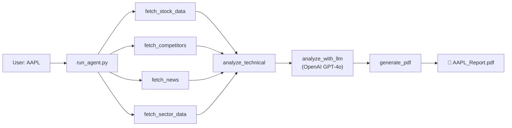

# StocksAgent — Implementation Plan

Build an AI-powered stock analysis agent following the WAT framework. The user provides a ticker (e.g., `AAPL`), and the agent collects data, performs analysis, and outputs a comprehensive PDF report with price forecasts for 1, 3, and 5 years.

## Architecture Overview



**Data flows through 3 stages:** Collect → Analyze → Report

---

## Proposed Changes

### Data Collection Tools

#### [NEW] [fetch_stock_data.py](file:///c:/Users/Abdullah%20ABo%20EL-Hija/Downloads/AntigraityAiCourse/StocksAgent/tools/fetch_stock_data.py)
- Uses `yfinance` to fetch **5 years** of historical price data (daily OHLCV)
- Pulls key financials: revenue, net income, EPS, P/E, P/B, debt-to-equity, margins, market cap
- Pulls company info: sector, industry, description, full name
- Returns a structured dict with all data

#### [NEW] [fetch_competitors.py](file:///c:/Users/Abdullah%20ABo%20EL-Hija/Downloads/AntigraityAiCourse/StocksAgent/tools/fetch_competitors.py)
- Given a ticker, uses the sector/industry info to identify top competitors
- Strategy: Uses OpenAI to identify the 4-5 most relevant competitors for the given company
- Fetches the same financial summary for each competitor via `yfinance`
- Returns a comparison table (P/E, market cap, revenue growth, margins)

#### [NEW] [fetch_news.py](file:///c:/Users/Abdullah%20ABo%20EL-Hija/Downloads/AntigraityAiCourse/StocksAgent/tools/fetch_news.py)
- Fetches recent news using `yfinance`'s built-in news feed + free RSS/Google News scraping
- Returns a list of headlines, sources, dates, and short summaries
- Targets ~20 most recent relevant articles

#### [NEW] [fetch_sector_data.py](file:///c:/Users/Abdullah%20ABo%20EL-Hija/Downloads/AntigraityAiCourse/StocksAgent/tools/fetch_sector_data.py)
- Fetches sector ETF performance (e.g., XLK for Technology) via `yfinance`
- Pulls sector-level trends: 1Y, 3Y, 5Y returns
- Provides context on how the broader sector is performing

---

### Analysis Tools

#### [NEW] [analyze_technical.py](file:///c:/Users/Abdullah%20ABo%20EL-Hija/Downloads/AntigraityAiCourse/StocksAgent/tools/analyze_technical.py)
- Calculates technical indicators from historical price data:
  - **Moving Averages**: SMA 50, SMA 200, EMA 20
  - **RSI** (14-period)
  - **MACD** (12, 26, 9)
  - **Support / Resistance** levels
  - **52-week high/low**
- Generates price chart with indicators saved as PNG to `.tmp/`

#### [NEW] [analyze_with_llm.py](file:///c:/Users/Abdullah%20ABo%20EL-Hija/Downloads/AntigraityAiCourse/StocksAgent/tools/analyze_with_llm.py)
- Takes ALL collected data (stock fundamentals, competitors, news, sector, technicals)
- Sends a structured prompt to **OpenAI GPT-4o** asking for:
  1. **Company Overview** — what they do, competitive position
  2. **Fundamental Analysis** — financial health, growth trajectory
  3. **Technical Analysis Summary** — trend direction, key levels
  4. **Competitor Comparison** — strengths vs. competitors
  5. **Sector Outlook** — industry tailwinds/headwinds
  6. **News Sentiment** — recent developments impact
  7. **Price Forecasts** — 1-year, 3-year, 5-year targets with bull/base/bear cases
  8. **Risk Factors** — key risks to watch
  9. **Investment Recommendation** — overall rating
- Returns structured JSON with all sections

---

### PDF Report

#### [NEW] [generate_pdf.py](file:///c:/Users/Abdullah%20ABo%20EL-Hija/Downloads/AntigraityAiCourse/StocksAgent/tools/generate_pdf.py)
- Uses `reportlab` to generate a professional PDF
- Includes:
  - Cover page with ticker, company name, date
  - Executive summary
  - Price chart (embedded PNG from technical analysis)
  - Fundamental metrics table
  - Competitor comparison table
  - Sector analysis section
  - News highlights
  - Price forecast table (1Y / 3Y / 5Y — Bull / Base / Bear)
  - Risk factors
  - Disclaimer
- Saves to project root: `{TICKER}_Report_{date}.pdf`

---

### Orchestration

#### [NEW] [run_agent.py](file:///c:/Users/Abdullah%20ABo%20EL-Hija/Downloads/AntigraityAiCourse/StocksAgent/tools/run_agent.py)
- CLI entry point: `python tools/run_agent.py AAPL`
- Orchestrates the full pipeline:
  1. Validate ticker
  2. Run data collection (stock, competitors, news, sector) — in parallel where possible
  3. Run technical analysis
  4. Send everything to LLM for analysis
  5. Generate PDF
  6. Print path to finished report
- Handles errors gracefully with retries

#### [NEW] [analyze_stock.md](file:///c:/Users/Abdullah%20ABo%20EL-Hija/Downloads/AntigraityAiCourse/StocksAgent/workflows/analyze_stock.md)
- WAT workflow SOP documenting the full stock analysis process

---

### Dependencies

#### [MODIFY] [requirements.txt](file:///c:/Users/Abdullah%20ABo%20EL-Hija/Downloads/AntigraityAiCourse/StocksAgent/requirements.txt)
```
yfinance          # Stock data
openai            # LLM analysis
reportlab         # PDF generation
matplotlib        # Charts
pandas            # Data manipulation
numpy             # Calculations
python-dotenv     # Environment variables
requests          # HTTP requests
beautifulsoup4    # News scraping
```

#### [MODIFY] [.env.example](file:///c:/Users/Abdullah%20ABo%20EL-Hija/Downloads/AntigraityAiCourse/StocksAgent/.env.example)
- Add `OPENAI_API_KEY` as required variable

---

## User Review Required

> [!IMPORTANT]
> **OpenAI API Key**: You'll need to provide your OpenAI API key. I'll need you to create a `.env` file with `OPENAI_API_KEY=sk-...` before we can run the agent.

> [!NOTE]
> **Cost estimate**: Each full analysis will use approximately **2,000-4,000 tokens** of GPT-4o input and **1,500-2,500 tokens** output. This costs roughly **$0.02-0.05 per analysis** — very cheap.

> [!NOTE]
> **Forecasting disclaimer**: The PDF will include a disclaimer that these are AI-generated estimates, not financial advice. Price targets are based on available data and AI reasoning, not guaranteed predictions.

---

## Verification Plan

### Automated Test
Run the agent end-to-end on a well-known S&P 500 stock:
```bash
python tools/run_agent.py AAPL
```

**Expected result:**
- No errors during execution
- `AAPL_Report_2026-03-14.pdf` created in project root
- PDF contains all sections: cover page, fundamentals, technicals, competitors, sector, news, forecasts

### Manual Verification
1. Open the generated PDF and verify it's readable and professionally formatted
2. Check that the price chart is embedded and shows technical indicators
3. Verify competitor data is accurate (P/E, market cap should match known values)
4. Confirm 1Y/3Y/5Y price forecasts are present with bull/base/bear scenarios
